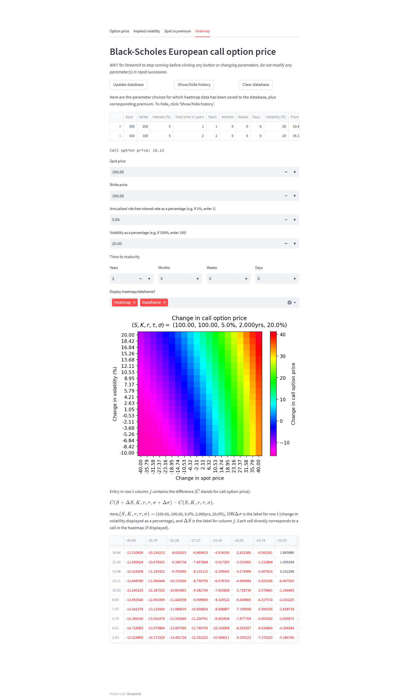
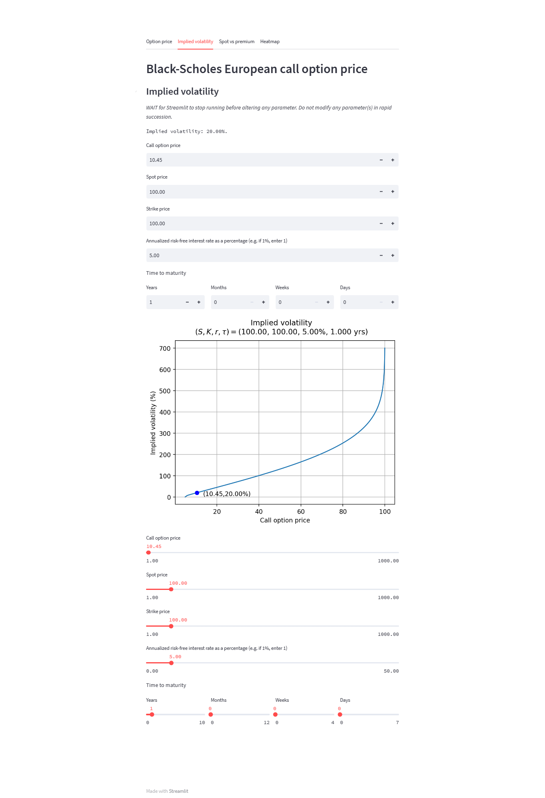
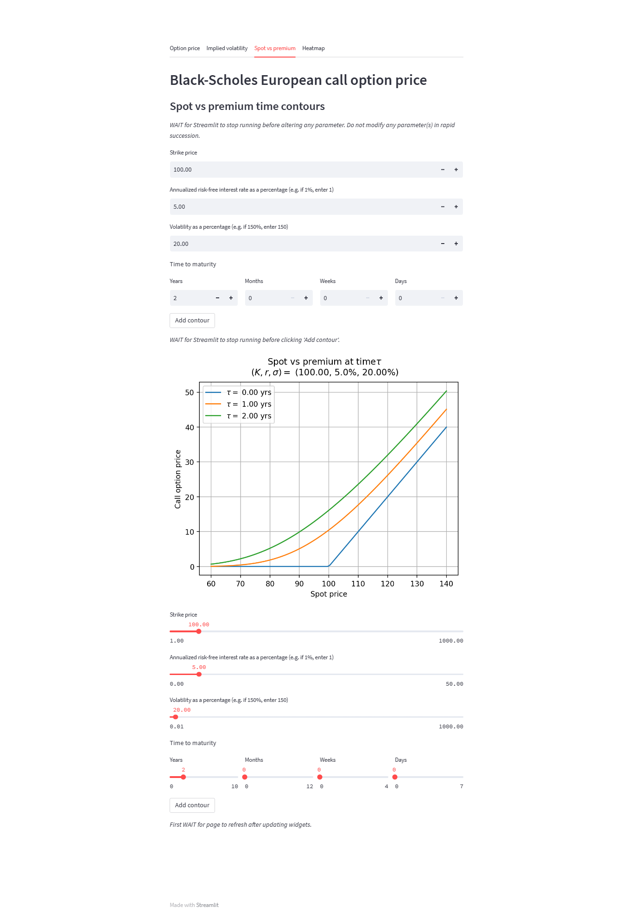

# black-scholes-option-pricer
An dashboard for plots, heatmaps etc., related to option prices, per the Black-Scholes model.

In Python, we employ Streamlit to create a sleek user interface allowing the user to input values for spot, strike, interest, time to maturity, and volatility. We compute corresponding European call option price according to Black-Scholes. We display a heatmap (matplotlib) reflecting the change in premium given a change in volatility and a change in spot price. The user can save this data to a database (SQLite) and retrieve it later on (database contains two tables related by primary/foreign key relation). The heatmap data can also be displayed in a pandas DataFrame. 

We also allow the user to compute/plot implied volatility, and spot vs premium contours of the Black-Scholes solution surface for chosen times to maturity. 

A picture tells a thousand words...

